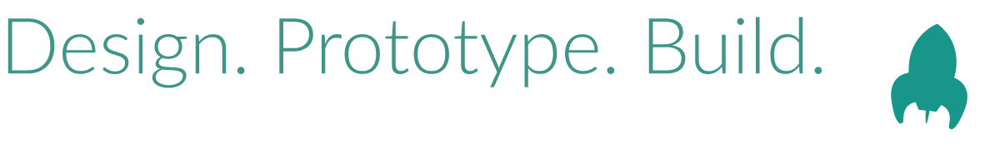

# Greetings, I'm Ryan! 👋

As a designer, developer, and individual I strive to do everything with diligence, integrity, and fervor. Always looking for a way to create work that is both useful and beautiful.

### About Me

I'm a **Senior Software Engineer** with over **10 years** of experience designing responsive web experiences, specializing in **design systems** and accessible component libraries.

- **Currently working on:** [Auro Design System](https://auro.alaskaair.com) at Alaska Airlines
- **Specializing in:** Design systems, web components, and developer experience
- **Tech Stack:** Web Components, Lit, Design Tokens, Storybook, GitHub Actions

### Open to Part-Time Opportunities

I'm currently **available for part-time design system work**, including:
- Contributing to existing design systems or establishing new foundations
- Improving tooling, automation, and developer experience

*If your team could use an extra set of hands with design system development, I'd love to connect!*

### Technologies & Tools

### Let's Connect

I love collaborating on design system projects and enjoy mentoring other developers. Whether you need help with an existing system, want to create a new project, or are looking for part-time design system expertise, I'd be happy to chat!

### GitHub Stats

### Top Languages

---

⚡ **Fun fact:** When I'm not coding, you can find me working on home automation projects, managing home lab infrastructure, or building and flying FPV drones!
