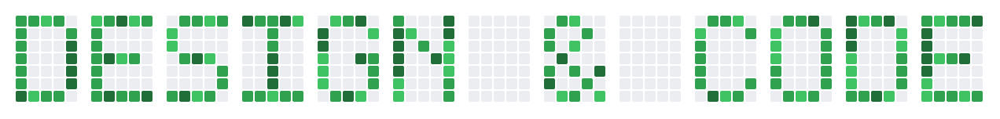
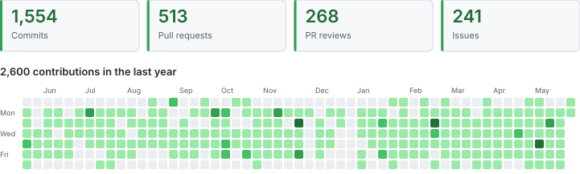

# Greetings, I'm Ryan! 👋

Ten years on the bridge between design and engineering. Currently shipping component and platform work on [Auro](https://auro.alaskaair.com), Alaska Airlines' design system. Previously on Campfire at Morgan Stanley.

### About Me

- **Currently working on:** [Auro Design System](https://auro.alaskaair.com) at Alaska Airlines
- **Before that:** Campfire Design System (Enterprise track) at Morgan Stanley
- **Tech Stack:** Web Components, Lit, Design Tokens, Storybook, GitHub Actions

### Technologies & Tools

### Let's Connect

If you're scaling a design system, fixing one that isn't working, or hiring a frontend engineer who can stay with hard problems, reach out.

### GitHub Stats

<!--STATS:START-->

_Updated 2026-05-18_
<!--STATS:END-->

---

Off the clock: home automation, home lab infrastructure, FPV drones I build and fly.
